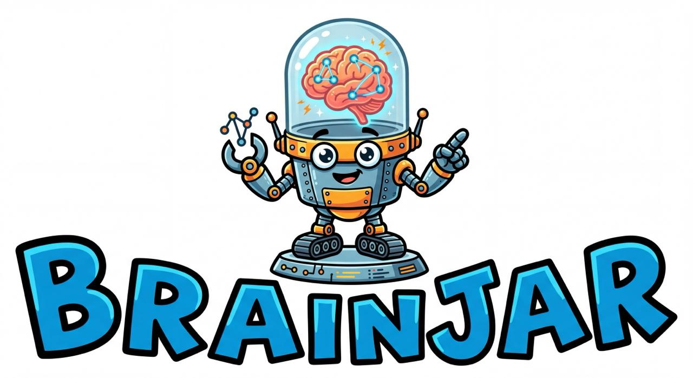

<p align="center">
  
</p>

<p align="center">
  <a href="https://buymeacoffee.com/lukel99"></a>
</p>

# 🧠 brainjar

> Local-first AI memory with hybrid search — FTS5, vocabulary fuzzy, graph traversal, and vector embeddings

brainjar gives AI agents persistent, searchable memory backed entirely by SQLite. Sync your markdown and code files, extract entities into a knowledge graph, and search with multiple complementary engines. Works as a standalone CLI or as an MCP server for Claude Code, Cursor, and any MCP-compatible tool.

## Features

- **Hybrid search** — FTS5 full-text search + graph entity traversal merged via RRF (Reciprocal Rank Fusion)
- **Vocabulary fuzzy** — typo correction via SQLite Levenshtein vocabulary table (no file scanning)
- **GraphRAG** — entity/relationship extraction using configurable LLM backends (Gemini, OpenAI, Ollama)
- **Zero cloud dependencies** — runs fully offline; all data lives in a single `.db` file
- **MCP server** — stdio transport, works with Claude Code, Cursor, Windsurf, and any MCP client
- **Multiple knowledge bases** — isolate personal memory, project docs, etc.
- **.brainjarignore** — gitignore-style file filtering during sync

## Quick Start

```bash
# Install from source
git clone https://github.com/Farad-Labs/brainjar
cd brainjar
cargo install --path .

# Initialize a new project in your workspace
cd my-agent-workspace
brainjar init

# Edit brainjar.toml to configure your knowledge bases
# Then sync your files
brainjar sync

# Search (FTS + graph by default, ~33ms)
brainjar search "deployment workflow"

# Fuzzy search — tolerates typos (~100ms)
brainjar search --fuzzy "deploymnt workflw"
```

## Search Modes

| Flag | Engine | Speed | Use when |
|------|--------|-------|----------|
| *(default)* | FTS5 BM25 + graph RRF | ~33ms | Fast, accurate searches |
| `--fuzzy` | Vocabulary-corrected FTS + graph | ~100ms | Typos, partial words, abbreviations |
| `--text` | FTS5 BM25 only | ~10ms | Pure text relevance, no graph |
| `--graph` | Entity graph traversal only | ~20ms | Concept/relationship queries |
| `--local` | Nucleo file scanner | ~50ms | Files not yet synced, raw file:line results |
| `--exact` | Case-insensitive substring | fast | Literal string matching |

```bash
# Default: FTS + graph merged via RRF
brainjar search "deployment workflow"

# Fuzzy: corrects "knowlege grph" → "knowledge graph" before searching
brainjar search --fuzzy "knowlege grph"

# Text only (BM25 relevance)
brainjar search --text "entity extraction"

# Graph only (traverses entity relationships)
brainjar search --graph "project entities"

# Raw file scanner (nucleo, returns file:line)
brainjar search --local "brainjar"

# Exact substring
brainjar search --exact "brainjar.toml"

# Limit results
brainjar search --limit 10 "search"

# Search a specific knowledge base
brainjar search --kb personal "morning routine"

# JSON output (for piping / agent use)
brainjar search --json "deployment"
```

### How Fuzzy Search Works

During `brainjar sync`, the vocabulary table is rebuilt from all indexed document content:

1. All tokens ≥ 3 chars are extracted from every document
2. Compound identifiers are split: `knowledge_graph` → `knowledge`, `graph`; `KnowledgeGraph` → `knowledge`, `graph`
3. Word frequencies are counted and stored in SQLite

At search time with `--fuzzy`:

1. Each query word is matched against the vocabulary
2. If the word exists exactly → kept as-is
3. If not found → closest match by Levenshtein distance (max 2 for short words, 3 for long)
4. Corrected query is run through FTS5 + graph
5. Corrections are shown: `✎ corrected: deploymnt → deployment`

## Entity Extraction (GraphRAG)

brainjar can extract entities and relationships from your documents using a configurable LLM, building a traversable knowledge graph stored alongside your documents in SQLite.

```toml
[extraction]
enabled = true
backend = "gemini"          # or "openai" or "ollama"
model = "gemini-3.1-flash-lite-preview"
api_key_env = "GOOGLE_API_KEY"
```

During sync, for each changed document:
- Entities (people, concepts, tools, projects) are extracted
- Relationships between entities are identified
- The graph is stored in `<kb_name>_graph.db`

Graph search traverses entity relationships to find documents connected to your query, even when exact terms don't match.

### Supported Backends

| Backend | Config | Notes |
|---------|--------|-------|
| Gemini | `provider = "gemini"` | Flash Lite recommended for cost |
| OpenAI | `provider = "openai"` | GPT-4o-mini works well |
| Ollama | `provider = "ollama"` | Local LLM, no API cost |

## Configuration

brainjar looks for config at:
1. `--config path/to/brainjar.toml` (explicit)
2. `./brainjar.toml` (current directory)
3. `~/.config/brainjar/config.toml` (global)

```toml
# brainjar.toml

[providers]
gemini.api_key = "${GEMINI_API_KEY}"
openai.api_key = "${OPENAI_API_KEY}"
# ollama.base_url = "http://localhost:11434"

[knowledge_bases.personal]
watch_paths = ["~/Documents/notes", "~/Documents/journal"]
auto_sync = true

[knowledge_bases.work]
watch_paths = ["~/Code/my-project"]
auto_sync = true

# Optional: entity extraction via LLM
[extraction]
provider = "gemini"
model = "gemini-3.1-flash-lite-preview"
enabled = true

# Optional: vector embeddings (coming soon)
[embeddings]
provider = "gemini"
model = "text-embedding-004"
dimensions = 768
```

### Knowledge Base Options

```toml
[knowledge_bases.myproject]
watch_paths = [
  "~/Code/myproject/docs",          # directory
  "~/Code/myproject/README.md",     # single file
  "~/Code/myproject/**/*.md",       # glob
]
auto_sync = true    # included in `brainjar sync` without --kb flag
```

## MCP Server

Run brainjar as an MCP server for use with Claude Code, Cursor, or any MCP client:

```bash
brainjar mcp
```

### Claude Code / `.mcp.json`

```json
{
  "mcpServers": {
    "brainjar": {
      "command": "brainjar",
      "args": ["mcp"]
    }
  }
}
```

### Cursor / `~/.cursor/mcp.json`

```json
{
  "mcpServers": {
    "brainjar": {
      "command": "brainjar",
      "args": ["mcp"],
      "cwd": "/path/to/your/workspace"
    }
  }
}
```

Available MCP tools: `search_memory`, `sync_memory`, `get_status`

## Cost

brainjar is designed for minimal ongoing cost:

| Scenario | Cost |
|----------|------|
| Initial ingestion (~276 docs) | ~$0.30 |
| Daily sync (changed files only) | ~$0.022/day |
| Monthly (Gemini Flash Lite extraction) | ~$0.66/month |
| Fuzzy search | $0.00 (local SQLite) |
| FTS + graph search | $0.00 (local SQLite) |

All search runs locally — zero API calls at query time.

## .brainjarignore

Place a `.brainjarignore` file in your config directory to exclude files from indexing. Uses gitignore-style glob patterns:

```
# .brainjarignore
*.log
*.tmp
secrets/
node_modules/
**/generated/**
```

Files are also filtered by extension. Only these types are indexed by default:
`md txt rs toml yaml yml json py js ts tsx jsx sh css html xml csv sql tf hcl conf ini cfg env`

Default excluded directories: `.git .venv node_modules __pycache__ target .brainjar dist build .next .nuxt .idea .vscode`

## Architecture

```
brainjar.toml
     │
     ▼
brainjar sync
     │
     ├─ Parse & hash files
     ├─ Upsert into documents table (SQLite WAL)
     ├─ FTS5 virtual table auto-updated via triggers
     ├─ Build vocabulary table (Levenshtein fuzzy)
     └─ Extract entities → knowledge graph (optional LLM)

brainjar search "query"
     │
     ├─ FTS5 BM25 search → ranked results
     ├─ Graph traversal from matching entities
     └─ RRF merge → top-N results

brainjar search --fuzzy "qurey"
     │
     ├─ Correct query via vocabulary (Levenshtein)  ← new
     ├─ FTS5 with corrected terms
     ├─ Graph with original + corrected terms
     └─ RRF merge + show corrections
```

### Database Layout

All data lives in `~/.brainjar/<kb_name>.db`:

| Table | Contents |
|-------|----------|
| `documents` | File path, content, SHA256 hash, updated_at |
| `documents_fts` | FTS5 virtual table (auto-synced via triggers) |
| `vocabulary` | Word → frequency (rebuilt each sync) |
| `meta` | Key/value metadata (last_sync, etc.) |

Graph data lives in `~/.brainjar/<kb_name>_graph.db` (GraphQLite).

## Commands

```bash
brainjar sync [kb_name] [--force] [--dry-run] [--json]
brainjar search <query> [--kb <name>] [--limit N] [--fuzzy|--text|--graph|--local|--exact] [--json]
brainjar status [kb_name] [--json]
brainjar init
brainjar mcp
```

## Why brainjar?

### Why not vector-only?

Vector search is great for semantic similarity but has real drawbacks for agent memory:
- Requires an embedding model (API cost or local GPU)
- Slow to build and query at scale
- Can't do exact or near-exact matching reliably
- Black box — hard to debug why a result ranked where it did

brainjar's FTS5 + graph + fuzzy approach gives you:
- **Exact precision** when you know the term
- **Semantic breadth** through entity graph traversal
- **Typo tolerance** through vocabulary correction
- **Zero query-time cost** — all runs in SQLite

### Why local-first?

- Your memory doesn't leave your machine (or your controlled infra)
- No API latency — search in 33ms, not 500ms
- Works offline
- You own the data — one `.db` file, portable forever
- No surprise bills from cloud KB services

## Development

```bash
git clone https://github.com/Farad-Labs/brainjar
cd brainjar
cargo build
cargo test
cargo clippy
cargo install --path .
```

### Roadmap

- [ ] Vector embeddings (sqlite-vec, Phase 3)
- [ ] MCP tool: `correct_query` (expose fuzzy correction to agents)
- [ ] Watch mode: `brainjar sync --watch` (inotify/FSEvents)
- [ ] Web UI for browsing the knowledge graph
