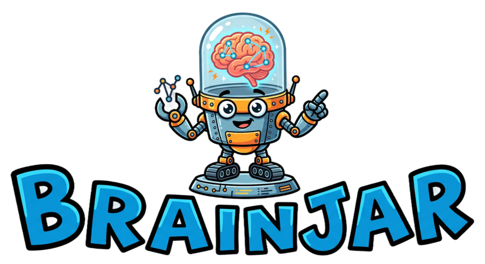

<p align="center">
  
</p>

<p align="center">
  <a href="https://buymeacoffee.com/lukel99"></a>
</p>

# 🧠 brainjar

> Local-first AI memory with hybrid search — FTS5, vocabulary fuzzy, graph traversal, and vector embeddings

brainjar gives AI agents persistent, searchable memory backed entirely by SQLite. Sync your markdown and code files, extract entities into a knowledge graph, and search with multiple complementary engines. Works as a standalone CLI or as an MCP server for Claude Code, Cursor, and any MCP-compatible tool.

## Features

- **Hybrid search** — fuzzy-corrected FTS5 + graph traversal + vector KNN, merged via RRF (Reciprocal Rank Fusion)
- **Vocabulary fuzzy** — typo correction via SQLite Levenshtein vocabulary table (no file scanning)
- **GraphRAG** — entity/relationship extraction using configurable LLM backends (Gemini, OpenAI, Ollama)
- **Zero cloud dependencies** — runs fully offline; all data lives in a single `.db` file
- **MCP server** — stdio transport, works with Claude Code, Cursor, Windsurf, and any MCP client
- **Multiple knowledge bases** — isolate personal memory, project docs, etc.
- **.brainjarignore** — gitignore-style file filtering during sync

## Quick Start

```bash
# Install Rust (if you don't have it)
brew install rust        # macOS (Homebrew)
curl --proto '=https' --tlsv1.2 -sSf https://sh.rustup.rs | sh  # Linux/other

# Install brainjar (includes local CPU embedding)
cargo install brainjar

# Slim build without local embedding (smaller binary, requires API key for embeddings)
# cargo install brainjar --no-default-features

# Initialize in your workspace (interactive wizard)
cd my-agent-workspace
brainjar init

# Sync your files
brainjar sync

# Re-embed all chunks (e.g. after changing embedding model/dimensions)
brainjar sync --reembed

# Search (fuzzy + graph + vector by default)
brainjar search "deployment workflow"

# Handles typos out of the box
brainjar search "deploymnt workflw"
```

## Search Modes

| Flag | Engine | Speed | Use when |
|------|--------|-------|----------|
| *(default)* | Fuzzy FTS5 + graph + vector | ~100ms | Best overall results, handles typos |
| `--text` | FTS5 BM25 (no fuzzy) | ~10ms | Exact term matching |
| `--graph` | Entity graph traversal | ~20ms | Concept/relationship queries |
| `--vector` | Semantic vector (ANN) | ~50ms | Semantic similarity, paraphrases |
| `--local` | Nucleo file scanner | ~50ms | Files not yet synced |
| `--smart` | LLM query extraction + default | ~500ms | Conversational/natural language |

Flags are **combinable**: `--graph --vector` runs graph + vector without text search. No flags = full default (fuzzy + graph + vector).

```bash
# Default: fuzzy + graph + vector merged via RRF
brainjar search "deployment workflow"

# Typos corrected automatically
brainjar search "knowlege grph"

# Text only (BM25 relevance)
brainjar search --text "entity extraction"

# Graph only (traverses entity relationships)
brainjar search --graph "project entities"

# Raw file scanner (nucleo, returns file:line)
brainjar search --local "brainjar"

# Exact substring
brainjar search --exact "brainjar.toml"

# Limit results
brainjar search --limit 10 "search"

# Smart: LLM extracts 2-5 targeted queries from conversational text
brainjar search --smart "should we use flash lite for auto-recall entity extraction?"
# 🧠 Extracted 3 queries: "auto-recall", "flash lite", "entity extraction"
# Results from all queries, deduplicated and ranked

# Search a specific knowledge base
brainjar search --kb personal "morning routine"

# JSON output (for piping / agent use)
brainjar search "deployment"          # JSON output (default)
brainjar search -H "deployment"       # human-readable output

# Return full chunk content instead of previews
brainjar search --chunks "deployment workflow"

# Aggregate chunk scores to document level
brainjar search --doc-score "deployment workflow"
```

### How Fuzzy Search Works

During `brainjar sync`, the vocabulary table is rebuilt from all indexed document content:

1. All tokens ≥ 3 chars are extracted from every document
2. Compound identifiers are split: `knowledge_graph` → `knowledge`, `graph`; `KnowledgeGraph` → `knowledge`, `graph`
3. Word frequencies are counted and stored in SQLite

At search time (default mode):

1. Each query word is matched against the vocabulary
2. If the word exists exactly → kept as-is
3. If not found → closest match by Levenshtein distance (max 2 for short words, 3 for long)
4. Corrected query is run through FTS5 + graph
5. Corrections are shown: `✎ corrected: deploymnt → deployment`

### Smart Search

For conversational or natural language queries, use `--smart` to let the LLM extract 2-5 targeted search terms before running the search:

```bash
brainjar search --smart "should we use flash lite for auto-recall entity extraction?"
# 🧠 Extracted 3 queries: "auto-recall", "flash lite", "entity extraction"
# Results from all queries, deduplicated and ranked by score
```

Smart search fans out across all extracted queries, deduplicates results by chunk ID, and returns a single ranked list. Requires `[extraction]` config (uses the same LLM provider as GraphRAG). Cost: ~$0.000025 per search with Flash Lite.

## Entity Extraction (GraphRAG)

brainjar can extract entities and relationships from your documents using a configurable LLM, building a traversable knowledge graph stored alongside your documents in SQLite.

```toml
[extraction]
enabled = true
backend = "gemini"          # or "openai" or "ollama"
model = "gemini-3.1-flash-lite-preview"
api_key_env = "GOOGLE_API_KEY"
```

During sync, for each changed document:
- Entities (people, concepts, tools, projects) are extracted
- Relationships between entities are identified
- The graph is stored in `<kb_name>_graph.db`

Graph search traverses entity relationships to find documents connected to your query, even when exact terms don't match.

### Supported Backends

| Backend | Status | Embeddings | Best For | Cost (1M tokens) |
|---------|--------|------------|----------|------------------|
| Gemini | ✅ Recommended | embedding-2 (3072 dims) | Highest quality (84.0% MTEB) | $0.20 |
| OpenAI | ✅ Tested | text-embedding-3-small/large (1024 dims) | Cost-sensitive workloads | $0.02–$0.13 |
| Ollama | ⚠️ Experimental | Local models | Local/offline use | Free (local) |

## Configuration

brainjar looks for config at:
1. `--config path/to/brainjar.toml` (explicit)
2. `./brainjar.toml` (current directory and parent directories)
3. `~/.brainjar/brainjar.toml` (default home)

```toml
# brainjar.toml

[providers]
gemini.api_key = "${GEMINI_API_KEY}"
openai.api_key = "${OPENAI_API_KEY}"
# ollama.base_url = "http://localhost:11434"

[knowledge_bases.personal]
watch_paths = ["~/Documents/notes", "~/Documents/journal"]
auto_sync = true

[knowledge_bases.work]
watch_paths = ["~/Code/my-project"]
auto_sync = true

# Optional: entity extraction via LLM
[extraction]
provider = "gemini"
model = "gemini-3.1-flash-lite-preview"
enabled = true

# Optional: vector embeddings
# Option A: Local (fast, no API key, included by default)
[embeddings]
provider = "local"                                 # ~30ms, runs on CPU
model = "bge-small-en-v1.5"                        # 62.2% MTEB, 384 dims

# Option B: API-based (higher quality, requires API key)
# [embeddings]
# provider = "openai"                              # or "gemini"
# model = "text-embedding-3-small"                 # 62.3% MTEB, 1536 dims
# dimensions = 1024                               # Matryoshka reduction (OpenAI/Gemini only)
```

> **Local embedding** is included by default. Model weights (~80MB) are downloaded on first use.
> For a slim build without local embedding, use `cargo install brainjar --no-default-features`.

> **Changing models or dimensions?** Run `brainjar sync --reembed` to regenerate all embeddings.
> Brainjar also auto-detects dimension mismatches and re-embeds when needed.

### Knowledge Base Options

```toml
[knowledge_bases.myproject]
watch_paths = [
  "~/Code/myproject/docs",          # directory
  "~/Code/myproject/README.md",     # single file
  "~/Code/myproject/**/*.md",       # glob
]
auto_sync = true    # included in `brainjar sync` without --kb flag
```

### Folder Configuration

For finer control, use `folders` instead of (or alongside) `watch_paths`. Each folder can have its own weight boost and temporal decay settings:

```toml
[knowledge_bases.my-notes]
auto_sync = true

[[knowledge_bases.my-notes.folders]]
title = "Source of Truth"
path = "docs/sot"
weight_boost = 0.3              # additive boost to search score for results from this folder

[[knowledge_bases.my-notes.folders]]
title = "Daily Notes"
path = "notes/daily"
weight_boost = 0.1

[knowledge_bases.my-notes.folders.decay]
horizon_days = 180              # score bottoms out after 180 days
floor = 0.3                     # minimum score multiplier (never below 30% of base score)
shape = 1.5                     # curve: >1 = slow start, 1.0 = linear, <1 = fast start
```

**`weight_boost`** -- additive boost to the final search score for any result from this folder. Use this to prioritize certain folders (e.g. source-of-truth docs rank higher than scratch notes).

**`decay`** -- temporal decay reduces search scores for older documents. The formula is:

```
score = floor + (1 - floor) * max(0, 1 - (age / horizon)^shape)
```

| Parameter | Description | Default |
|-----------|-------------|---------|
| `horizon_days` | Age in days when score reaches the floor | (required) |
| `floor` | Minimum score multiplier, 0.0 to 1.0 | 0.3 |
| `shape` | Curve steepness: 1.0 = linear, >1 = slow initial decay, <1 = fast initial decay | 1.0 |

If `decay` is omitted, the folder has no temporal decay (documents always score at full weight).

**Backward compatible:** plain `watch_paths` still works. Folders without decay or boost behave identically to the old format.

## Watch Mode

Monitor knowledge bases for changes and auto-sync:

```bash
brainjar watch                    # poll every 5 minutes (default)
brainjar watch --interval 60      # poll every 60 seconds
brainjar watch --kb my-notes      # watch specific KB only
brainjar watch --daemon           # run in background
brainjar watch --stop             # stop background watcher
```

Configure default interval in `brainjar.toml`:

```toml
[watch]
interval = 300    # seconds
```

> ⚠️ **Active development warning:** Each sync cycle with changes triggers embedding API calls. For codebases under active development, consider a longer interval or watching specific KBs to manage costs.

Lock files prevent concurrent syncs. If `brainjar sync` is run manually while the watcher is active, one will wait for the other to finish.

## MCP Server

Run brainjar as an MCP server for use with Claude Code, Cursor, or any MCP client:

```bash
brainjar mcp
```

### Claude Code / `.mcp.json`

```json
{
  "mcpServers": {
    "brainjar": {
      "command": "brainjar",
      "args": ["mcp"]
    }
  }
}
```

### Cursor / `~/.cursor/mcp.json`

```json
{
  "mcpServers": {
    "brainjar": {
      "command": "brainjar",
      "args": ["mcp"],
      "cwd": "/path/to/your/workspace"
    }
  }
}
```

Available MCP tools: `search_memory`, `sync_memory`, `get_status`

## Cost

brainjar is designed for minimal ongoing cost:

| Scenario | Cost |
|----------|------|
| Initial ingestion (~276 docs) | ~$0.30 |
| Daily sync (changed files only) | ~$0.022/day |
| Monthly (Gemini Flash Lite extraction) | ~$0.66/month |
| Fuzzy search | $0.00 (local SQLite) |
| FTS + graph search | $0.00 (local SQLite) |

All search runs locally — zero API calls at query time.

## .brainjarignore

Place a `.brainjarignore` file in your config directory to exclude files from indexing. Uses gitignore-style glob patterns:

```
# .brainjarignore
*.log
*.tmp
secrets/
node_modules/
**/generated/**
```

Files are also filtered by extension. Only these types are indexed by default:
`md txt rs toml yaml yml json py js ts tsx jsx sh css html xml csv sql tf hcl conf ini cfg env`

Default excluded directories: `.git .venv node_modules __pycache__ target .brainjar dist build .next .nuxt .idea .vscode`

## Architecture

```
brainjar.toml
     │
     ▼
brainjar sync
     │
     ├─ Parse & hash files
     ├─ Upsert into documents table (SQLite WAL)
     ├─ FTS5 virtual table auto-updated via triggers
     ├─ Build vocabulary table (Levenshtein fuzzy)
     └─ Extract entities → knowledge graph (optional LLM)

brainjar search "query"
     │
     ├─ FTS5 BM25 search → ranked results
     ├─ Graph traversal from matching entities
     └─ RRF merge → top-N results

brainjar search "qurey"
     │
     ├─ Correct query via vocabulary (Levenshtein)  ← new
     ├─ FTS5 with corrected terms
     ├─ Graph with original + corrected terms
     └─ RRF merge + show corrections
```

### Database Layout

All data lives in `~/.brainjar/<kb_name>.db`:

| Table | Contents |
|-------|----------|
| `documents` | File path, content, SHA256 hash, updated_at |
| `documents_fts` | FTS5 virtual table (auto-synced via triggers) |
| `vocabulary` | Word → frequency (rebuilt each sync) |
| `meta` | Key/value metadata (last_sync, etc.) |

Graph data lives in `~/.brainjar/<kb_name>_graph.db` (GraphQLite).

## Commands

```bash
brainjar sync [kb_name] [--force] [--dry-run] [-H]
brainjar search <query> [--kb <name>] [--limit N] [--text] [--graph] [--vector] [--local] [--smart] [--chunks] [--doc-score] [-H]
brainjar status [kb_name] [-H]
brainjar init
brainjar mcp
```

### Retrieve

```bash
# Fetch full content of a chunk by ID
brainjar retrieve <chunk_id>

# Chunk content + surrounding raw lines from source file
brainjar retrieve <chunk_id> --lines-before 10 --lines-after 20

# Chunk content + neighboring chunks
brainjar retrieve <chunk_id> --chunks-before 1 --chunks-after 1
```

## Why brainjar?

### Why not vector-only?

Vector search is great for semantic similarity but has real drawbacks for agent memory:
- Requires an embedding model (API cost or local GPU)
- Slow to build and query at scale
- Can't do exact or near-exact matching reliably
- Black box — hard to debug why a result ranked where it did

brainjar's FTS5 + graph + fuzzy approach gives you:
- **Exact precision** when you know the term
- **Semantic breadth** through entity graph traversal
- **Typo tolerance** through vocabulary correction
- **Zero query-time cost** — all runs in SQLite

### Why local-first?

- Your memory doesn't leave your machine (or your controlled infra)
- No API latency — search in 33ms, not 500ms
- Works offline
- You own the data — one `.db` file, portable forever
- No surprise bills from cloud KB services

## Docker

brainjar ships a multi-stage `Dockerfile` (Rust builder → debian-slim runtime) and a `docker-compose.yml` for quick local deployment.

### Build the image

```bash
docker build -t brainjar .
```

### Sync a knowledge base

Mount your KB source files at `/kb` and a persistent data volume at `/data`.
Place a `brainjar.toml` config in the KB directory (or at `/data/brainjar.toml`) that points `watch_paths` at `/kb`:

```bash
docker run --rm \
  -v brainjar-data:/data \
  -v ./my-kb:/kb \
  -e GOOGLE_API_KEY="$GOOGLE_API_KEY" \
  brainjar sync --config /kb/brainjar.toml
```

### Search

```bash
docker run --rm \
  -v brainjar-data:/data \
  -v ./my-kb:/kb \
  brainjar search "query" --config /kb/brainjar.toml
```

### docker-compose

Copy `.env.example` or export your API keys, then:

```bash
# Start and run a sync
docker compose run --rm brainjar sync --config /kb/brainjar.toml

# Search
docker compose run --rm brainjar search "deployment workflow" --config /kb/brainjar.toml

# MCP server (keep running for Claude Code / Cursor)
docker compose up
```

The `brainjar-data` named volume persists your SQLite databases across container restarts.
Edit `docker-compose.yml` to change the knowledge base path (default: `./my-knowledge`).

---

## Development

```bash
git clone https://github.com/Farad-Labs/brainjar
cd brainjar
cargo build
cargo test                              # unit + integration tests
cargo test --features golden-corpus     # includes golden corpus (needs API keys)
cargo clippy
cargo install --path .
```

### Golden Corpus QA

PRs to `main` run the full golden corpus test suite with **both Gemini and OpenAI** providers. Results are uploaded as a GitHub Actions artifact (`golden-corpus-summary.md`).

- **Gemini:** `gemini-embedding-2-preview` (3072 dims)
- **OpenAI:** `text-embedding-3-large` (1024 dims)
- **Pass threshold:** 16/16 tests for both providers

### Roadmap

- [x] `brainjar retrieve` — fetch full chunk content with line/chunk context
- [x] Chunking — split documents into overlapping chunks for better recall
- [x] `--chunks` flag on search — return full chunk content instead of previews
- [x] `--doc-score` flag on search — aggregate chunk scores to document level
- [x] Watch mode: `brainjar watch` (polling-based file watcher)
- [x] Smart search — conversational queries decomposed into targeted search terms
- [x] OpenAI embedding support (text-embedding-3-small/large)
- [x] Composable search modes (--text, --graph, --vector, --local, --smart)
- [ ] MCP tool: `correct_query` (expose fuzzy correction to agents)
- [ ] Web UI for browsing the knowledge graph
